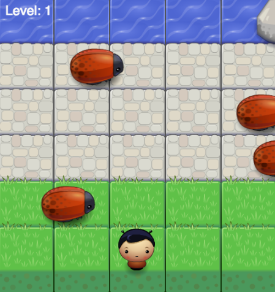

frontend-nanodegree-arcade-game
===============================

This is a recreation of the classic arcade game "Frogger".

The purpose of this project was to gain an understanding of how basic game engines work, get used to reading partial code and understanding how to work with it. Other lesseons included getting practical experience with  OOP in javascript and event-handlers. 

The app is hosted on gh-pages <a href="http://llanginger.github.io/FEND-Frogger/"> here:</a>

Having had the benefit of a LOT more practical experience since completing this project, I intend on revisiting it shortly to polish off the rough edges. Updates will be posted
